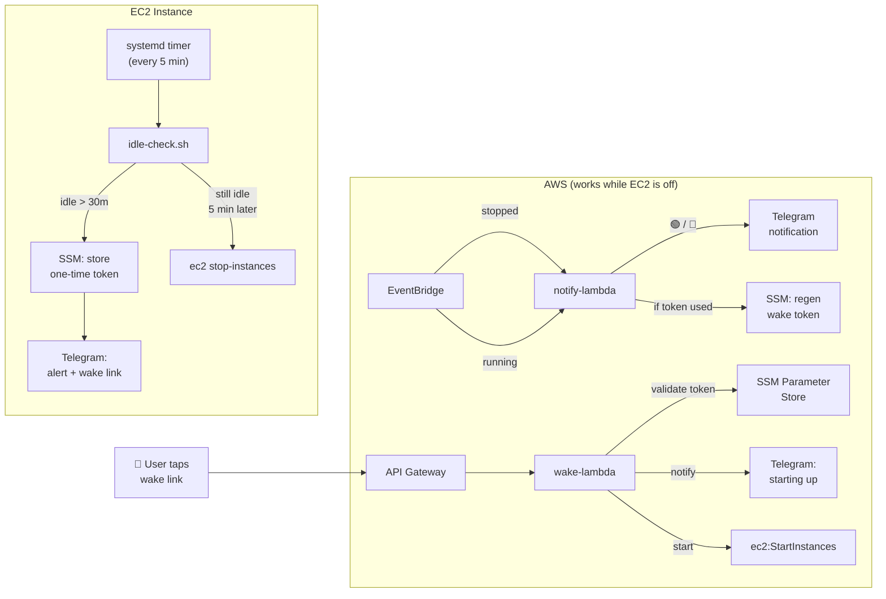

# BOOTSTRAP-IDLE-SHUTDOWN.md — Idle Shutdown & Wake for EC2 Agents

> **Purpose:** Automatically shut down the EC2 instance after 30 minutes of user inactivity. Sends a Telegram alert with a **one-tap wake link** before shutdown. EventBridge notifies you when the instance starts or stops, and auto-generates a fresh wake link on shutdown.



---

## How It Works

### Idle Detection (on-instance)

1. A **systemd timer** fires every 5 minutes
2. A bash script reads OpenClaw session JSONL files to find the last **real** user message
3. Only messages with Telegram `sender_id` metadata count — heartbeat polls, system notifications, and memory flushes are excluded
4. If idle > 30 min: generates a one-time UUID wake token, stores it in SSM, sends Telegram alert with wake link
5. On the next run (5 min later), if still idle: shuts down via `aws ec2 stop-instances`
6. If recently booted (< 15 min): shutdown is skipped to prevent the wake → immediate re-shutdown race

### Wake Link (serverless, works while EC2 is off)

1. User taps wake link in Telegram → API Gateway → Wake Lambda
2. Lambda validates the one-time token from SSM → deletes it → starts instance
3. Guards against invalid states: rejects if instance is `running`, `stopping`, or `pending`
4. Shows a styled HTML status page in the browser

### EventBridge Notifications (serverless)

1. **Instance starts** → Telegram notification: 🟢 Machine is up
2. **Instance stops** → Telegram notification: 🔴 Machine is shut down + wake link
3. On stop: if the wake token was already used, **auto-generates a fresh one** so you always have a valid wake link

---

## Prerequisites

- EC2 instance with an instance profile that has `ssm:PutParameter` permission
- OpenClaw installed and configured with Telegram
- Telegram bot token and your numeric chat ID
- Python 3 on the instance
- IAM permissions for creating Lambdas, API Gateway, EventBridge rules, and SSM parameters

---

## Step 1 — Store Configuration in SSM

All config lives in SSM Parameter Store — nothing hardcoded in scripts or Lambda code.

```bash
REGION="us-east-1"
INSTANCE_ID="<your-instance-id>"
TELEGRAM_CHAT_ID="<your-numeric-chat-id>"
TELEGRAM_BOT_TOKEN="<your-bot-token>"

aws ssm put-parameter --name "/openclaw/wake-config/instance-id" \
  --value "$INSTANCE_ID" --type String --overwrite --region "$REGION"

aws ssm put-parameter --name "/openclaw/wake-config/telegram-chat-id" \
  --value "$TELEGRAM_CHAT_ID" --type String --overwrite --region "$REGION"

aws ssm put-parameter --name "/openclaw/wake-config/telegram-bot-token" \
  --value "$TELEGRAM_BOT_TOKEN" --type SecureString --overwrite --region "$REGION"
```

---

## Step 2 — Python Helper

Save to `~/.openclaw/workspace/idle-check.py`:

```python
#!/usr/bin/env python3
"""idle-check.py — Timestamp parsing, idle detection, state management.

Only counts REAL human messages (with Telegram sender metadata) as activity.
Heartbeat polls, system notifications, and memory flushes are excluded.
"""
import sys, json, os
from datetime import datetime, timezone


def parse_ts(ts):
    for fmt in ('%Y-%m-%dT%H:%M:%S.%fZ', '%Y-%m-%dT%H:%M:%SZ'):
        try:
            return datetime.strptime(ts, fmt).replace(tzinfo=timezone.utc)
        except ValueError:
            pass
    return None


_AUTOMATED_PREFIXES = (
    'Read HEARTBEAT.md',
    'System:',
    'Pre-compaction memory flush',
)

def _is_real_user_message(text):
    """Return True only for genuine human messages."""
    if not text:
        return False
    if '"sender_id"' in text:
        return True
    for prefix in _AUTOMATED_PREFIXES:
        if text.startswith(prefix):
            return False
    return False


def _extract_text(obj):
    msg = obj.get('message', {})
    content = msg.get('content', []) if isinstance(msg, dict) else []
    if isinstance(content, list) and content:
        first = content[0]
        return first.get('text', '') if isinstance(first, dict) else str(first)
    elif isinstance(content, str):
        return content
    return ''


def latest_user_ts(sessions_dir):
    """Find the most recent real user message timestamp across session JSONL files."""
    latest = None
    for fname in os.listdir(sessions_dir):
        if not fname.endswith('.jsonl') or '.checkpoint.' in fname:
            continue
        path = os.path.join(sessions_dir, fname)
        try:
            with open(path) as f:
                for line in f:
                    try:
                        obj = json.loads(line)
                        msg = obj.get('message', {})
                        role = msg.get('role') if isinstance(msg, dict) else obj.get('role')
                        if role != 'user':
                            continue
                        text = _extract_text(obj)
                        if not _is_real_user_message(text):
                            continue
                        ts = obj.get('createdAt') or obj.get('timestamp') or obj.get('ts')
                        if ts and (latest is None or ts > latest):
                            latest = ts
                    except (json.JSONDecodeError, KeyError):
                        pass
        except OSError:
            pass
    return latest


def hours_idle(ts_str):
    dt = parse_ts(ts_str)
    if dt is None:
        return None
    return (datetime.now(timezone.utc) - dt).total_seconds() / 3600


def get_state(state_file, key):
    try:
        with open(state_file) as f:
            return json.load(f).get(key, False)
    except (OSError, json.JSONDecodeError):
        return False


def set_state(state_file, key, value):
    """Atomic-ish write via tmp + rename."""
    try:
        with open(state_file) as f:
            data = json.load(f)
    except (OSError, json.JSONDecodeError):
        data = {}
    data[key] = value
    tmp = state_file + '.tmp'
    with open(tmp, 'w') as f:
        json.dump(data, f, indent=2)
    os.replace(tmp, state_file)


def get_uptime_hours():
    try:
        with open('/proc/uptime') as f:
            return float(f.read().split()[0]) / 3600
    except (OSError, ValueError):
        return 999


if __name__ == '__main__':
    if len(sys.argv) < 2:
        print("Usage: idle-check.py <command> [args...]", file=sys.stderr)
        sys.exit(1)

    cmd = sys.argv[1]

    if cmd == '--latest-ts':
        ts = latest_user_ts(sys.argv[2])
        print(ts or '')
    elif cmd == '--hours-idle':
        h = hours_idle(sys.argv[2])
        if h is None:
            print('PARSE_ERROR')
            sys.exit(1)
        print(f'{h:.4f}')
    elif cmd == '--should-shutdown':
        print('yes' if float(sys.argv[2]) > float(sys.argv[3]) else 'no')
    elif cmd == '--uptime-hours':
        print(f'{get_uptime_hours():.4f}')
    elif cmd == '--get-state':
        print(str(get_state(sys.argv[2], sys.argv[3])).lower())
    elif cmd == '--set-state':
        val = sys.argv[4]
        parsed = True if val == 'true' else False if val == 'false' else val
        set_state(sys.argv[2], sys.argv[3], parsed)
    else:
        print(f"Unknown command: {cmd}", file=sys.stderr)
        sys.exit(1)
```

---

## Step 3 — Idle Check Script

Save to `~/.openclaw/workspace/idle-check.sh`:

```bash
#!/bin/bash
# idle-check.sh — Idle monitor (systemd timer, every 5 min)
# Shuts down after 30 min of no real user messages.
# Sends Telegram alert with one-time wake link before shutdown.
#
# Usage:
#   ./idle-check.sh              # normal mode
#   ./idle-check.sh --dry-run    # log what would happen, don't shutdown or alert
set -euo pipefail

# --- Config ---
REGION="us-east-1"
IDLE_THRESHOLD_HOURS=0.5       # 30 minutes
MIN_UPTIME_HOURS=0.25          # skip if booted < 15 min ago
LOG_MAX_LINES=500
SSM_TOKEN_PARAM="/openclaw/wake-token"
SSM_BOT_TOKEN_PARAM="/openclaw/wake-config/telegram-bot-token"
SSM_CHAT_ID_PARAM="/openclaw/wake-config/telegram-chat-id"
WAKE_LAMBDA_URL="<your-api-gateway-url>/wake"  # from Step 5

SCRIPT_DIR="$(dirname "$(readlink -f "$0")")"
STATE_FILE="$HOME/.openclaw/workspace/memory/heartbeat-state.json"
SESSIONS_DIR="$HOME/.openclaw/agents/main/sessions"
PY="$SCRIPT_DIR/idle-check.py"
LOG="/tmp/idle-check.log"

DRY_RUN=false
[[ "${1:-}" == "--dry-run" ]] && DRY_RUN=true

# --- Helpers ---
log() { echo "$(date -u +%Y-%m-%dT%H:%M:%SZ) $*" >> "$LOG"; }

truncate_log() {
  if [[ -f "$LOG" ]] && (( $(wc -l < "$LOG") > LOG_MAX_LINES )); then
    tail -n "$LOG_MAX_LINES" "$LOG" > "${LOG}.tmp" && mv "${LOG}.tmp" "$LOG"
  fi
}

fetch_ssm() {
  local param="$1"
  local decrypt="${2:-false}"
  if [[ "$decrypt" == "true" ]]; then
    aws ssm get-parameter --name "$param" --region "$REGION" \
      --query Parameter.Value --output text --with-decryption 2>/dev/null
  else
    aws ssm get-parameter --name "$param" --region "$REGION" \
      --query Parameter.Value --output text 2>/dev/null
  fi
}

send_telegram() {
  local token="$1" chat_id="$2" text="$3"
  python3 -c "
import json, urllib.request
data = json.dumps({'chat_id': '$chat_id', 'text': '''$text''', 'disable_web_page_preview': True}).encode()
req = urllib.request.Request('https://api.telegram.org/bot$token/sendMessage', data=data, headers={'Content-Type': 'application/json'})
urllib.request.urlopen(req)
" >> "$LOG" 2>&1
}

# --- Main ---
truncate_log

if $DRY_RUN; then log "=== DRY RUN ==="; fi

LATEST_TS=$(python3 "$PY" --latest-ts "$SESSIONS_DIR")
if [[ -z "$LATEST_TS" ]]; then
  log "ERROR: No user messages found in session logs."
  exit 1
fi

HOURS_IDLE=$(python3 "$PY" --hours-idle "$LATEST_TS")
if [[ "$HOURS_IDLE" == "PARSE_ERROR" ]]; then
  log "ERROR: Could not parse timestamp: $LATEST_TS"
  exit 1
fi

log "idle=${HOURS_IDLE}h last_msg=${LATEST_TS}"

SHOULD_SHUTDOWN=$(python3 "$PY" --should-shutdown "$HOURS_IDLE" "$IDLE_THRESHOLD_HOURS")
if [[ "$SHOULD_SHUTDOWN" != "yes" ]]; then
  python3 "$PY" --set-state "$STATE_FILE" idleShutdownAlertSent false
  exit 0
fi

# Guard: skip if recently booted
UPTIME_H=$(python3 "$PY" --uptime-hours)
if (( $(echo "$UPTIME_H < $MIN_UPTIME_HOURS" | bc -l) )); then
  log "SKIP: uptime=${UPTIME_H}h < ${MIN_UPTIME_HOURS}h — recently booted"
  python3 "$PY" --set-state "$STATE_FILE" idleShutdownAlertSent false
  exit 0
fi

ALERT_SENT=$(python3 "$PY" --get-state "$STATE_FILE" idleShutdownAlertSent)

if [[ "$ALERT_SENT" == "false" ]]; then
  log "IDLE >${IDLE_THRESHOLD_HOURS}h — generating wake token"

  if $DRY_RUN; then
    log "DRY RUN: Would generate wake token, store in SSM, send Telegram alert"
    exit 0
  fi

  WAKE_TOKEN=$(python3 -c "import uuid; print(uuid.uuid4())")
  if ! aws ssm put-parameter --name "$SSM_TOKEN_PARAM" --value "$WAKE_TOKEN" \
       --type String --overwrite --region "$REGION" > /dev/null 2>&1; then
    log "ERROR: Failed to store wake token in SSM"
    exit 1
  fi

  TG_TOKEN=$(fetch_ssm "$SSM_BOT_TOKEN_PARAM" true)
  TG_CHAT=$(fetch_ssm "$SSM_CHAT_ID_PARAM")
  if [[ -z "$TG_TOKEN" || -z "$TG_CHAT" ]]; then
    log "ERROR: Failed to fetch Telegram credentials from SSM"
    exit 1
  fi

  WAKE_LINK="${WAKE_LAMBDA_URL}?token=${WAKE_TOKEN}"
  send_telegram "$TG_TOKEN" "$TG_CHAT" \
    "🐺 Idle for over 30 min. Shutting down in ~5 min.\n\n👉 Tap to wake: ${WAKE_LINK}"

  python3 "$PY" --set-state "$STATE_FILE" idleShutdownAlertSent true
  log "Alert sent. Will shutdown on next run."
else
  if $DRY_RUN; then
    log "DRY RUN: Would shutdown NOW"
    exit 0
  fi

  log "SHUTTING DOWN"
  # Use instance metadata to get own instance ID
  INSTANCE_ID=$(curl -sf -H "X-aws-ec2-metadata-token: $(curl -sf -X PUT http://169.254.169.254/latest/api/token -H 'X-aws-ec2-metadata-token-ttl-seconds: 21600')" \
    http://169.254.169.254/latest/meta-data/instance-id)
  aws ec2 stop-instances --instance-ids "$INSTANCE_ID" --region "$REGION"
fi
```

---

## Step 4 — Systemd Timer

```bash
sudo tee /etc/systemd/system/idle-check.service << 'EOF'
[Unit]
Description=Agent idle check — shutdown if user is away for over 30 min

[Service]
Type=oneshot
User=ec2-user
ExecStart=/bin/bash /home/ec2-user/.openclaw/workspace/idle-check.sh
TimeoutSec=30
EOF

sudo tee /etc/systemd/system/idle-check.timer << 'EOF'
[Unit]
Description=Agent idle check timer — every 5 minutes

[Timer]
OnBootSec=5min
OnUnitActiveSec=5min
AccuracySec=10s
Persistent=true

[Install]
WantedBy=timers.target
EOF

sudo systemctl daemon-reload
sudo systemctl enable --now idle-check.timer
```

Verify: `sudo systemctl status idle-check.timer`

---

## Step 5 — Wake Lambda

### 5.1 — IAM Role

```bash
ACCOUNT_ID="$(aws sts get-caller-identity --query Account --output text)"

aws iam create-role \
  --role-name wake-lambda-role \
  --assume-role-policy-document '{
    "Version": "2012-10-17",
    "Statement": [{
      "Effect": "Allow",
      "Principal": {"Service": "lambda.amazonaws.com"},
      "Action": "sts:AssumeRole"
    }]
  }'

aws iam put-role-policy \
  --role-name wake-lambda-role \
  --policy-name wake-permissions \
  --policy-document "{
    \"Version\": \"2012-10-17\",
    \"Statement\": [
      {
        \"Effect\": \"Allow\",
        \"Action\": \"ec2:StartInstances\",
        \"Resource\": \"arn:aws:ec2:${REGION}:${ACCOUNT_ID}:instance/<your-instance-id>\"
      },
      {
        \"Effect\": \"Allow\",
        \"Action\": \"ec2:DescribeInstanceStatus\",
        \"Resource\": \"*\"
      },
      {
        \"Effect\": \"Allow\",
        \"Action\": [\"ssm:GetParameter\", \"ssm:DeleteParameter\"],
        \"Resource\": [
          \"arn:aws:ssm:${REGION}:${ACCOUNT_ID}:parameter/openclaw/wake-token\",
          \"arn:aws:ssm:${REGION}:${ACCOUNT_ID}:parameter/openclaw/wake-config/*\"
        ]
      },
      {
        \"Effect\": \"Allow\",
        \"Action\": [\"logs:CreateLogGroup\",\"logs:CreateLogStream\",\"logs:PutLogEvents\"],
        \"Resource\": \"arn:aws:logs:${REGION}:${ACCOUNT_ID}:*\"
      }
    ]
  }"

sleep 10  # IAM propagation
```

### 5.2 — Lambda Code

Save as `index.mjs`:

```javascript
import { SSMClient, GetParameterCommand, DeleteParameterCommand } from "@aws-sdk/client-ssm";
import { EC2Client, StartInstancesCommand, DescribeInstanceStatusCommand } from "@aws-sdk/client-ec2";

const ssm = new SSMClient({});
const ec2 = new EC2Client({});
const TOKEN_PARAM = "/openclaw/wake-token";
const CONFIG_PREFIX = "/openclaw/wake-config/";

async function getParam(name, decrypt = false) {
  const res = await ssm.send(new GetParameterCommand({ Name: name, WithDecryption: decrypt }));
  return res.Parameter.Value;
}

async function sendTelegram(botToken, chatId, text) {
  await fetch(`https://api.telegram.org/bot${botToken}/sendMessage`, {
    method: "POST",
    headers: { "Content-Type": "application/json" },
    body: JSON.stringify({ chat_id: chatId, text, disable_web_page_preview: true }),
  });
}

const html = (title, msg, emoji) => ({
  statusCode: 200,
  headers: { "content-type": "text/html; charset=utf-8" },
  body: `<!DOCTYPE html><html><head><meta name="viewport" content="width=device-width,initial-scale=1"><title>${title}</title>
  <style>body{font-family:-apple-system,system-ui,sans-serif;display:flex;justify-content:center;align-items:center;min-height:100vh;margin:0;background:#0D1117;color:#F0F6FC;text-align:center}
  .card{background:#161B22;border:1px solid #30363D;border-radius:12px;padding:2rem;max-width:400px}
  h1{font-size:3rem;margin:0}p{color:#8B949E;font-size:1.1rem}</style></head>
  <body><div class="card"><h1>${emoji}</h1><h2>${title}</h2><p>${msg}</p></div></body></html>`
});

export const handler = async (event) => {
  const token = event.queryStringParameters?.token;
  if (!token) return html("Missing Token", "No wake token provided.", "❌");

  let stored;
  try {
    stored = await getParam(TOKEN_PARAM);
  } catch (e) {
    if (e.name === "ParameterNotFound")
      return html("Expired", "This wake link has already been used or expired.", "⏰");
    throw e;
  }
  if (token !== stored) return html("Invalid Token", "This wake link is not valid.", "🚫");

  // Consume the one-time token
  await ssm.send(new DeleteParameterCommand({ Name: TOKEN_PARAM }));

  const [instanceId, chatId, botToken] = await Promise.all([
    getParam(CONFIG_PREFIX + "instance-id"),
    getParam(CONFIG_PREFIX + "telegram-chat-id"),
    getParam(CONFIG_PREFIX + "telegram-bot-token", true),
  ]);

  // Guard: only start if fully stopped
  try {
    const status = await ec2.send(new DescribeInstanceStatusCommand({
      InstanceIds: [instanceId], IncludeAllInstances: true
    }));
    const state = status.InstanceStatuses?.[0]?.InstanceState?.Name;
    if (state === "running") {
      await sendTelegram(botToken, chatId, "🐺 Already running — no action needed.");
      return html("Already Running", "Instance is already up!", "✅");
    }
    if (state === "stopping") {
      await sendTelegram(botToken, chatId, "🐺 Still shutting down. Wait a minute and try again.");
      return html("Still Stopping", "Wait a moment and try the link again.", "⏳");
    }
    if (state === "pending") {
      await sendTelegram(botToken, chatId, "🐺 Already starting up — hang tight.");
      return html("Starting Up", "Already starting. Give it a minute.", "⏳");
    }
  } catch (e) { /* proceed anyway */ }

  await sendTelegram(botToken, chatId, "🐺 Starting up — should be ready in ~60 seconds.");

  try {
    await ec2.send(new StartInstancesCommand({ InstanceIds: [instanceId] }));
  } catch (e) {
    if (!e.message?.includes("cannot be started")) throw e;
  }

  return html("Waking Up! 🐺", "Instance is starting. Give it about 60 seconds.", "🐺");
};
```

Deploy:

```bash
cd /tmp/wake-lambda && zip -j wake-lambda.zip index.mjs

aws lambda create-function \
  --function-name agent-wake \
  --runtime nodejs22.x \
  --handler index.handler \
  --role "arn:aws:iam::${ACCOUNT_ID}:role/wake-lambda-role" \
  --zip-file fileb:///tmp/wake-lambda.zip \
  --timeout 10 --memory-size 128 --architectures arm64 \
  --region "$REGION"
```

### 5.3 — HTTP API Gateway

> Lambda Function URLs may be blocked by AWS Organizations SCPs. HTTP API Gateway is the reliable alternative (~$0/month at this scale).

```bash
API_ID=$(aws apigatewayv2 create-api \
  --name "agent-wake" --protocol-type HTTP \
  --region "$REGION" --query 'ApiId' --output text)

INTEGRATION_ID=$(aws apigatewayv2 create-integration \
  --api-id "$API_ID" --integration-type AWS_PROXY \
  --integration-uri "arn:aws:lambda:${REGION}:${ACCOUNT_ID}:function:agent-wake" \
  --payload-format-version "2.0" \
  --region "$REGION" --query 'IntegrationId' --output text)

aws apigatewayv2 create-route \
  --api-id "$API_ID" --route-key "GET /wake" \
  --target "integrations/$INTEGRATION_ID" --region "$REGION"

aws apigatewayv2 create-stage \
  --api-id "$API_ID" --stage-name '$default' \
  --auto-deploy --region "$REGION"

aws lambda add-permission \
  --function-name agent-wake \
  --statement-id apigateway-invoke \
  --action lambda:InvokeFunction \
  --principal apigateway.amazonaws.com \
  --source-arn "arn:aws:execute-api:${REGION}:${ACCOUNT_ID}:${API_ID}/*" \
  --region "$REGION"

WAKE_URL=$(aws apigatewayv2 get-api --api-id "$API_ID" \
  --region "$REGION" --query 'ApiEndpoint' --output text)
echo "Wake URL: ${WAKE_URL}/wake"
# ↑ Put this in idle-check.sh WAKE_LAMBDA_URL
```

---

## Step 6 — EventBridge Notification Lambda

This Lambda fires on instance start/stop. On start it sends 🟢. On stop it sends 🔴 with a wake link (auto-generates a fresh token if the previous one was consumed).

### 6.1 — IAM Role

```bash
aws iam create-role \
  --role-name ec2-notify-lambda-role \
  --assume-role-policy-document '{
    "Version": "2012-10-17",
    "Statement": [{
      "Effect": "Allow",
      "Principal": {"Service": "lambda.amazonaws.com"},
      "Action": "sts:AssumeRole"
    }]
  }'

aws iam put-role-policy \
  --role-name ec2-notify-lambda-role \
  --policy-name notify-permissions \
  --policy-document "{
    \"Version\": \"2012-10-17\",
    \"Statement\": [
      {
        \"Effect\": \"Allow\",
        \"Action\": [\"logs:CreateLogGroup\",\"logs:CreateLogStream\",\"logs:PutLogEvents\"],
        \"Resource\": \"arn:aws:logs:${REGION}:${ACCOUNT_ID}:*\"
      },
      {
        \"Effect\": \"Allow\",
        \"Action\": \"ec2:DescribeInstances\",
        \"Resource\": \"*\"
      },
      {
        \"Effect\": \"Allow\",
        \"Action\": [\"ssm:GetParameter\", \"ssm:PutParameter\"],
        \"Resource\": [
          \"arn:aws:ssm:${REGION}:${ACCOUNT_ID}:parameter/openclaw/wake-config/*\",
          \"arn:aws:ssm:${REGION}:${ACCOUNT_ID}:parameter/openclaw/wake-token\"
        ]
      }
    ]
  }"

sleep 10
```

### 6.2 — Lambda Code

Save as `notify.py`:

```python
import json
import os
import uuid
import urllib.request
import boto3

def handler(event, context):
    instance_id = event['detail']['instance-id']
    state = event['detail']['state']

    target_instance = os.environ.get('INSTANCE_ID')
    if target_instance and instance_id != target_instance:
        return

    ssm = boto3.client('ssm')
    telegram_token = ssm.get_parameter(
        Name='/openclaw/wake-config/telegram-bot-token', WithDecryption=True
    )['Parameter']['Value']
    chat_id = os.environ['TELEGRAM_CHAT_ID']
    wake_url = os.environ.get('WAKE_URL')

    if state == 'running':
        ec2 = boto3.client('ec2')
        response = ec2.describe_instances(InstanceIds=[instance_id])
        public_ip = response['Reservations'][0]['Instances'][0].get('PublicIpAddress')
        if not public_ip:
            return
        message = f"🟢 Machine is up and running.\n\nPublic IP: {public_ip}"

    elif state == 'stopped':
        token_param = '/openclaw/wake-token'
        try:
            token = ssm.get_parameter(Name=token_param)['Parameter']['Value']
            token_needed = False
        except ssm.exceptions.ParameterNotFound:
            token = str(uuid.uuid4())
            ssm.put_parameter(Name=token_param, Value=token,
                              Type='String', Overwrite=True)
            token_needed = True

        wake_link = f"{wake_url}?token={token}"
        status = "⚠️ Wake token was expired — generated a new one." if token_needed \
            else "✅ Wake token is still valid."
        message = f"🔴 Machine is shut down.\n\n{status}\n\n👉 Tap to wake:\n{wake_link}"

    else:
        return

    tg_body = json.dumps({
        'chat_id': chat_id,
        'text': message,
        'parse_mode': 'Markdown',
        'disable_web_page_preview': True
    }).encode()
    urllib.request.urlopen(urllib.request.Request(
        f"https://api.telegram.org/bot{telegram_token}/sendMessage",
        data=tg_body, headers={'Content-Type': 'application/json'}
    ))

    return {'state': state}
```

Deploy:

```bash
cd /tmp && zip -j notify-lambda.zip notify.py

aws lambda create-function \
  --function-name ec2-notify \
  --runtime python3.13 \
  --handler notify.handler \
  --role "arn:aws:iam::${ACCOUNT_ID}:role/ec2-notify-lambda-role" \
  --zip-file fileb:///tmp/notify-lambda.zip \
  --timeout 15 --memory-size 128 --architectures arm64 \
  --environment "Variables={INSTANCE_ID=<your-instance-id>,TELEGRAM_CHAT_ID=<your-chat-id>,WAKE_URL=${WAKE_URL}/wake}" \
  --region "$REGION"
```

### 6.3 — EventBridge Rule

```bash
aws events put-rule \
  --name ec2-state-notify \
  --event-pattern "{
    \"source\": [\"aws.ec2\"],
    \"detail-type\": [\"EC2 Instance State-change Notification\"],
    \"detail\": {
      \"state\": [\"running\", \"stopped\"],
      \"instance-id\": [\"<your-instance-id>\"]
    }
  }" \
  --description "Telegram notify on instance start/stop" \
  --region "$REGION"

NOTIFY_ARN=$(aws lambda get-function --function-name ec2-notify \
  --query 'Configuration.FunctionArn' --output text --region "$REGION")

aws events put-targets \
  --rule ec2-state-notify \
  --targets "Id=notify-lambda,Arn=$NOTIFY_ARN" \
  --region "$REGION"

aws lambda add-permission \
  --function-name ec2-notify \
  --statement-id eventbridge-invoke \
  --action lambda:InvokeFunction \
  --principal events.amazonaws.com \
  --source-arn "arn:aws:events:${REGION}:${ACCOUNT_ID}:rule/ec2-state-notify" \
  --region "$REGION"
```

---

## Verify

```bash
# Wake Lambda rejects bad tokens
curl -s "${WAKE_URL}/wake?token=fake" | grep -oP '<h2>\K[^<]+'
# → "Invalid Token" or "Expired"

# Idle check runs cleanly
sudo systemctl start idle-check.service
cat /tmp/idle-check.log | tail -3

# Timer is active
sudo systemctl status idle-check.timer
```

---

## Security

| Layer | Protection |
|-------|-----------|
| API Gateway URL | Random subdomain, not guessable or indexed |
| One-time UUID token | Stored in SSM, deleted after use. Expired tokens → friendly error page |
| Lambda permissions | Scoped to one specific instance |
| Telegram link preview | `disable_web_page_preview: true` on all messages with wake links (prevents Telegram from auto-fetching the link and triggering a wake) |
| No hardcoded secrets | All config in SSM Parameter Store, fetched at runtime |
| State guards | Wake Lambda rejects if instance is `running`, `stopping`, or `pending` |
| Min uptime guard | 15 min — prevents wake → immediate re-shutdown race |

**Cost:** ~$0/month. Lambda free tier + HTTP API Gateway ($1/million requests) + SSM free tier.

---

## Notes

- The timer is **independent of OpenClaw** — if the gateway crashes, idle shutdown still works
- The two-step shutdown (alert → wait 5 min → shutdown) gives you time to tap the wake link
- Session parsing handles both flat and nested JSONL message formats, and skips checkpoint files
- Log auto-truncates to 500 lines
- `--dry-run` mode logs what would happen without sending alerts or shutting down
