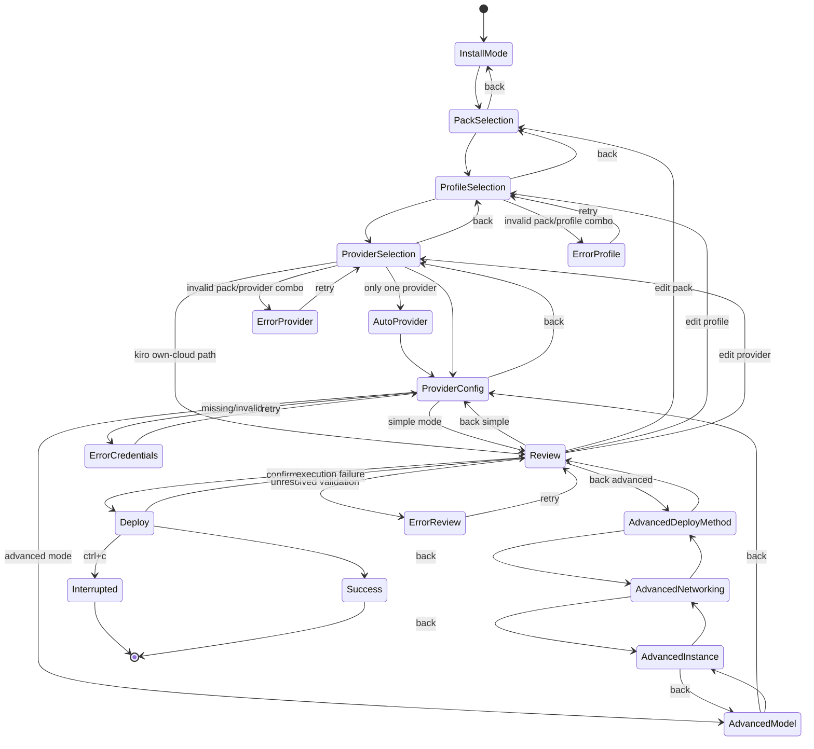

# TUI Deploy Wizard Implementation Plan

## Scope

This document defines the implementation plan for the TUI Deploy Wizard for `loki-agent`. It covers the interactive `gum`-based wizard, the generated `bootstrap.sh` command, advanced-mode branches, back navigation, error handling, scenario parity, and test strategy. It does **not** implement the wizard.

The authoritative UX source is [`proposed-design/design-page.html`](/tmp/loki-agent/proposed-design/design-page.html). Supporting architecture and runtime sources are:

- [`proposed-design/PROVIDER-PACKS-DESIGN.md`](/tmp/loki-agent/proposed-design/PROVIDER-PACKS-DESIGN.md)
- [`packs/registry.yaml`](/tmp/loki-agent/packs/registry.yaml)
- [`providers/bedrock/manifest.yaml`](/tmp/loki-agent/providers/bedrock/manifest.yaml)
- [`providers/anthropic-api/manifest.yaml`](/tmp/loki-agent/providers/anthropic-api/manifest.yaml)
- [`providers/openai-api/manifest.yaml`](/tmp/loki-agent/providers/openai-api/manifest.yaml)
- [`providers/openrouter/manifest.yaml`](/tmp/loki-agent/providers/openrouter/manifest.yaml)
- [`providers/litellm/manifest.yaml`](/tmp/loki-agent/providers/litellm/manifest.yaml)
- [`deploy/bootstrap.sh`](/tmp/loki-agent/deploy/bootstrap.sh)
- [`install.sh`](/tmp/loki-agent/install.sh)
- [`deploy/cloudformation/template.yaml`](/tmp/loki-agent/deploy/cloudformation/template.yaml)
- [`deploy/terraform/variables.tf`](/tmp/loki-agent/deploy/terraform/variables.tf)

## Source-of-Truth Rules

1. UX, screen order, journeys, and scenario coverage come from `design-page.html`.
2. Pack defaults come from `packs/registry.yaml`.
3. Provider defaults, auth modes, models, context windows, and max tokens come from `providers/*/manifest.yaml`.
4. The wizard must generate the exact `deploy/bootstrap.sh` command line for the selected state.
5. CloudFormation and Terraform parameter mapping must remain compatible with current deploy surfaces, even where `install.sh` still uses older parameter arrays.

## Current Gaps To Reconcile During Implementation

The plan assumes the wizard will enforce a normalized compatibility layer, because the repo currently contains drift:

- The HTML design shows `openrouter` and some non-Bedrock support on Hermes, Pi, and Claude Code.
- `packs/registry.yaml` currently limits non-Bedrock support mostly to `openclaw`.
- `providers/openrouter/manifest.yaml` exists, but its `compatibility.packs` is currently empty.
- `deploy/bootstrap.sh` supports `--provider`, `--provider-auth-type`, `--provider-key-secret-id`, `--provider-key`, `--model`, and LiteLLM legacy flags, but not yet a generic `--provider-base-url`.
- `install.sh` still builds deploy parameters around legacy `model_mode` instead of the full provider-pack design.

Implementation should not hide this mismatch. It should:

- Render the UX described in the HTML.
- Load live compatibility from YAML.
- Fail early if the design-expected provider is unavailable in the runtime data.
- Add a small normalization layer so the wizard can explain disabled choices with the exact reason.

## 1. Architecture

### New Entry Point

- Create [`deploy/wizard.sh`](/tmp/loki-agent/deploy/wizard.sh) as the new interactive TUI entry point.
- Responsibility:
  - dependency checks and auto-install for `gum` v0.17.0
  - load and normalize pack/provider metadata
  - drive the wizard state machine
  - validate every step
  - render review summary
  - generate the exact `bootstrap.sh` command
  - either execute deploy or print command in dry-run mode

### Runtime Dependencies

- `gum` v0.17.0
- `jq`
- `python3`

### Auto-Install Behavior

- If `gum` is missing or wrong version:
  - show `gum spin` progress
  - install using the same strategy already used by `install.sh`
  - verify `gum --version` resolves to `0.17.0`
- If `jq` or `python3` is missing:
  - hard fail with install instructions
  - do not attempt deploy

### Data Loading Layer

Implement a normalization helper, ideally in `deploy/lib/wizard-data.sh` plus a small Python helper if YAML parsing is easier:

- Pack catalog:
  - source: `packs/registry.yaml`
  - fields: `pack id`, description, `supported_providers`, compatible profiles, default instance type, default root/data volume, ports, experimental flags
- Provider catalog:
  - source: `providers/*/manifest.yaml`
  - fields: display name, auth modes, required env, base URL template, region requirement, default models, model metadata, compatibility
- Effective compatibility matrix:
  - primary source for Step 3 filtering: `pack.supported_providers`
  - secondary source: provider manifest `compatibility.packs`
  - if either source denies support, treat as unsupported and show reason

### Command Generation Layer

The wizard outputs an exact command for `deploy/bootstrap.sh`, with shell-safe quoting:

```bash
bash deploy/bootstrap.sh --pack <pack> --profile <profile> --provider <provider> ...
```

Generation rules:

- always include `--pack`
- include `--profile` except Kiro path can omit provider flags
- include `--provider` for every provider-backed pack
- include `--region` only when region is required or selected
- include `--provider-auth-type` for Bedrock IAM vs bearer
- include `--provider-key` for direct-key and bearer flows
- include `--provider-key-secret-id` only if secret-mode is added later
- include `--model` for primary override
- include provider-specific legacy compatibility flags when needed by current runtime:
  - `--litellm-base-url` or planned generic `--provider-base-url`
  - `--gw-port`
  - other pack-specific passthroughs preserved by the design

### Execution Modes

- Interactive wizard mode: default
- `--dry-run`: do not deploy; print generated `bootstrap.sh` command and derived CFN/TF parameters
- `--non-interactive` parity mode: reuse the same validation and generation code paths

## 2. All Screens

Each screen below includes component, data source, validation, back behavior, and state variable(s).

### Step 0: Install Mode

- Component: `gum choose`
- Source: hardcoded options from design
- Options:
  - `simple`
  - `advanced`
- Validation: required single choice
- Back: none, this is entry screen
- Captures:
  - `installMode: "simple" | "advanced"`

### Step 1: Choose Agent Pack

- Component: `gum choose`
- Source: `packs/registry.yaml`
- Render:
  - pack display line
  - description
  - provider badges from `supported_providers`
  - badges/order styled like the dark design
- Default:
  - `openclaw`
- Validation:
  - selected pack must exist in registry
  - skip base packs such as `bedrockify`
- Back:
  - left/back returns to Step 0
- Captures:
  - `pack`

### Step 2: Permission Profile

- Component: `gum choose`
- Source: hardcoded profile catalog plus optional pack restriction from `compatible_profiles`
- Options:
  - `builder`
  - `account_assistant`
  - `personal_assistant`
- Validation:
  - required
  - if pack has `compatible_profiles`, selection must be in that list
  - if pack is `nemoclaw`, only `personal_assistant` is allowed
- Back:
  - returns to Step 1
- Captures:
  - `profile`

### Step 3: LLM Provider

- Component: `gum choose`
- Source:
  - `packs/registry.yaml` `supported_providers`
  - `providers/*/manifest.yaml`
  - hardcoded own-cloud special case for `kiro-cli`
- Render:
  - enabled providers
  - disabled providers with “why disabled” text
  - auto-select Bedrock when it is the only supported provider
- Validation:
  - provider must be supported by pack and provider manifest
  - `kiro-cli` skips provider config entirely and records `provider = "own-cloud"`
- Back:
  - returns to Step 2
- Captures:
  - `provider`

### Step 4: Provider Config

#### Bedrock IAM

- Components:
  - auth mode: `gum choose`
  - region: `gum choose`
  - optional model override: `gum input`
- Source:
  - auth modes from `providers/bedrock/manifest.yaml`
  - region list from `deploy/cloudformation/template.yaml` allowed values
  - default model from provider manifest
- Validation:
  - auth mode must be `iam`
  - region required, must be one of supported Bedrock regions
  - model override optional; if set, must be non-empty and match a known model id unless explicit freeform override mode is allowed
- Back:
  - returns to Step 3
- Captures:
  - `providerAuthType = "iam"`
  - `providerRegion`
  - `primaryModelOverride`

#### Bedrock Bearer

- Components:
  - auth mode: `gum choose`
  - region: `gum choose`
  - bearer token: `gum input --password`
  - optional model override: `gum input`
- Source:
  - manifest + design
- Validation:
  - auth mode must be `bearer`
  - token required
  - sanity check: non-empty and preferably `ABS-` prefix per design mockup
  - region required
- Back:
  - returns to Step 3
- Captures:
  - `providerAuthType = "bearer"`
  - `providerRegion`
  - `providerKey`
  - `primaryModelOverride`

#### Anthropic API

- Components:
  - API key: `gum input --password`
  - optional model override: `gum input`
- Source:
  - `providers/anthropic-api/manifest.yaml`
- Validation:
  - key required
  - must start with `sk-ant-` or `sk-ant-api`
  - model override optional
- Back:
  - returns to Step 3
- Captures:
  - `providerKey`
  - `primaryModelOverride`

#### OpenAI API

- Components:
  - API key: `gum input --password`
  - optional model override: `gum input`
- Source:
  - `providers/openai-api/manifest.yaml`
- Validation:
  - key required
  - must start with `sk-`
  - model override optional
- Back:
  - returns to Step 3
- Captures:
  - `providerKey`
  - `primaryModelOverride`

#### OpenRouter

- Components:
  - API key: `gum input --password`
  - optional model override: `gum input`
- Source:
  - `providers/openrouter/manifest.yaml`
- Validation:
  - key required
  - minimal sanity: length > 10
  - if a format convention is later defined, validate it here
- Back:
  - returns to Step 3
- Captures:
  - `providerKey`
  - `primaryModelOverride`

#### LiteLLM

- Components:
  - base URL: `gum input`
  - optional API key: `gum input --password`
  - optional model override: `gum input`
- Source:
  - `providers/litellm/manifest.yaml`
- Validation:
  - base URL required
  - must parse as `http://` or `https://`
  - API key optional
  - model override optional
- Back:
  - returns to Step 3
- Captures:
  - `providerBaseUrl`
  - `providerKey`
  - `primaryModelOverride`

### Advanced Step A1: Model Configuration

- Components:
  - `gum input` for primary override
  - `gum input` for fallback override
  - `gum input` for context window
  - `gum input` for max tokens
- Source:
  - selected provider manifest defaults and selected primary/fallback model metadata
- Validation:
  - fields optional except numeric fields once edited
  - context window must be positive integer
  - max tokens must be positive integer
  - if model ids are set, verify against provider models or allow explicit override with warning
- Back:
  - returns to Step 4 provider config
- Captures:
  - `primaryModelOverride`
  - `fallbackModelOverride`
  - `contextWindowOverride`
  - `maxTokensOverride`

### Advanced Step A2: Instance & Storage

- Components:
  - instance type: `gum choose`
  - root volume: `gum input`
  - data volume: `gum input`
- Source:
  - defaults from `packs/registry.yaml`
  - allowed instance families from design + deploy templates
- Validation:
  - instance type must be ARM64 allowed value
  - root volume integer 20-200
  - data volume integer 0 or 20-500
  - for `nemoclaw`, enforce minimum `t4g.xlarge`
- Back:
  - returns to Advanced A1
- Captures:
  - `instanceType`
  - `rootVolumeGb`
  - `dataVolumeGb`

### Advanced Step A3: Networking

- Components:
  - VPC mode: `gum choose`
  - SSH access mode: `gum choose`
  - Telegram token: `gum input --password`
  - allowed chat IDs: `gum input`
- Source:
  - hardcoded choices from design
  - pack-specific NemoClaw messaging requirements
- Validation:
  - VPC mode: `new` or `existing`
  - if `existing`, defer actual VPC/subnet selection to follow-on deploy integration or capture placeholders for `ExistingVpcId` and `ExistingSubnetId`
  - SSH access:
    - `ssm-only` -> key pair blank and `SSHAllowedCidr=127.0.0.1/32`
    - `keypair` -> later require key pair selection/input
  - Telegram token optional except if enabling NemoClaw bot features
  - chat IDs comma-separated integers
- Back:
  - returns to Advanced A2
- Captures:
  - `vpcMode`
  - `sshAccessMode`
  - `telegramToken`
  - `allowedChatIds`

### Advanced Step A4: Deploy Method

- Component: `gum choose`
- Source: hardcoded options from design and current `install.sh`
- Options:
  - `cfn-cli`
  - `cfn-console`
  - `terraform`
- Validation:
  - required
  - if `terraform`, verify Terraform availability or mark post-review blocking validation
- Back:
  - returns to Advanced A3
- Captures:
  - `deployMethod`

### Step 5: Review

- Components:
  - `gum style` formatted summary
  - `gum confirm` for deploy
  - `gum choose` for edit target if user chooses not to deploy
- Source:
  - full wizard state
  - resolved provider defaults
  - pack dependencies from registry
- Validation:
  - run all cross-field validations before enabling deploy
  - display checkmarks and actionable errors
- Back:
  - generic back returns to previous logical screen
  - edit action jumps to selected screen while preserving state
- Captures:
  - `reviewAction = "deploy" | "back" | "edit:<step>"`

### Step 6: Deploy

- Components:
  - `gum spin`
  - `gum style` for status
- Source:
  - generated command
  - deploy method
- Behavior:
  - `cfn-cli`: execute deploy wrapper or print exact command
  - `cfn-console`: print/open generated console URL and parameter set
  - `terraform`: execute or print generated terraform path/vars
- Validation:
  - final command exists and required secrets/fields are present
- Back:
  - no back after actual execution starts
  - on failure, return to Review with error summary and preserved state
- Captures:
  - `deployResult`
  - `generatedBootstrapCommand`
  - `generatedCfnParams`
  - `generatedTerraformVars`

## 3. Flow State Machine



### Error States

- `ErrorProfile`: pack/profile mismatch
- `ErrorProvider`: pack/provider mismatch
- `ErrorCredentials`: missing API key, invalid prefix, missing base URL, invalid region
- `ErrorReview`: unresolved cross-field validation or deploy method readiness
- `Deploy failure`: network error, Terraform unavailable, bootstrap command failure

### Recovery Rules

- all validation failures are non-destructive and preserve state
- secret fields remain in memory but are re-masked on redisplay
- deploy failures route back to Review with the failed command and stderr summary

## 4. All 19 CLI Scenarios

Each scenario maps to a wizard path and resulting generated command.

| # | Scenario | Wizard Path |
|---|---|---|
| 1 | Simple + Bedrock IAM (Bedrock default) | Step0 `simple` -> Step1 `openclaw` -> Step2 `builder` -> Step3 `bedrock` -> Step4 `iam`, region `us-east-1` -> Review -> Deploy |
| 2 | Simple + Anthropic API key | `simple` -> `openclaw` -> `builder` -> `anthropic-api` -> API key -> Review |
| 3 | Simple + OpenAI API key | `simple` -> `openclaw` -> `builder` -> `openai-api` -> API key -> Review |
| 4 | Simple + OpenRouter | `simple` -> `openclaw` -> `builder` -> `openrouter` -> API key -> Review |
| 5 | Simple + LiteLLM | `simple` -> `openclaw` -> `builder` -> `litellm` -> base URL + optional key -> Review |
| 6 | Hermes + Anthropic | `simple` -> `hermes` -> `builder` -> `anthropic-api` -> API key -> Review |
| 7 | Hermes + OpenRouter | `simple` -> `hermes` -> `builder` -> `openrouter` -> API key -> Review |
| 8 | Claude Code + Bedrock | `simple` -> `claude-code` -> `builder` -> `bedrock` -> `iam`, region -> Review |
| 9 | Claude Code + Anthropic | `simple` -> `claude-code` -> `builder` -> `anthropic-api` -> API key -> Review |
| 10 | Pi + OpenRouter | `simple` -> `pi` -> `builder` -> `openrouter` -> API key -> Review |
| 11 | Hermes + Bedrock | `simple` -> `hermes` -> `builder` -> `bedrock` -> `iam`, region -> Review |
| 12 | Hermes + OpenAI | `simple` -> `hermes` -> `builder` -> `openai-api` -> API key -> Review |
| 13 | Pi + Bedrock | `simple` -> `pi` -> `builder` -> auto-select `bedrock` if only supported runtime provider, else manual select -> region -> Review |
| 14 | Pi + LiteLLM | `simple` -> `pi` -> `builder` -> `litellm` -> base URL -> Review |
| 15 | IronClaw + Bedrock | `simple` -> `ironclaw` -> `builder` -> auto-select `bedrock` -> region -> Review |
| 16 | NemoClaw + Bedrock | `simple` -> `nemoclaw` -> `personal_assistant` only -> auto-select `bedrock` -> region -> Review |
| 17 | Kiro CLI | `simple` -> `kiro-cli` -> `builder` -> skip Step3/4 provider config -> Review with post-install login note |
| 18 | Model override | `advanced` -> `openclaw` -> `builder` -> `bedrock` -> Step4 -> A1 set primary override -> Review |
| 19 | Minimal (all defaults) | non-interactive or `simple` default selections: `openclaw` + `builder` + `bedrock` + `us-east-1` |

### Additional Storyboard Journeys To Preserve

These are not separate rows in the 19-command table, but they are explicit design branches and must exist in the interactive wizard:

- Bedrock bearer alternate path: `simple|advanced` -> provider `bedrock` -> auth `bearer`
- Advanced model-override journey: `advanced` path through A1-A4
- Missing API key error journey: Step 4 validation-blocked retry flow
- Review edit/back journey: Review -> targeted screen -> return to Review with preserved state

### Design Note

The runtime YAML must support all 19 scenarios for the wizard to claim full parity. If current manifests/registry do not yet permit a scenario shown in the HTML, implementation should either:

- update those YAML sources first, or
- block the scenario with a clearly labeled “design/runtime mismatch” error during development

Do not silently downgrade the choice.

## 5. Data Model

```ts
type InstallMode = "simple" | "advanced";
type Profile = "builder" | "account_assistant" | "personal_assistant";
type Provider = "bedrock" | "anthropic-api" | "openai-api" | "openrouter" | "litellm" | "own-cloud";
type ProviderAuthType = "iam" | "bearer" | "api-key" | "proxy" | "";
type DeployMethod = "cfn-cli" | "cfn-console" | "terraform";
type VpcMode = "new" | "existing";
type SshAccessMode = "ssm-only" | "keypair";

interface WizardState {
  installMode: InstallMode;
  pack: string;
  profile: Profile;
  provider: Provider;
  providerAuthType: ProviderAuthType;
  providerRegion: string;
  providerKey: string;
  providerKeySecretId: string;
  providerBaseUrl: string;
  primaryModelOverride: string;
  fallbackModelOverride: string;
  contextWindowOverride: number | null;
  maxTokensOverride: number | null;
  instanceType: string;
  rootVolumeGb: number;
  dataVolumeGb: number;
  vpcMode: VpcMode;
  existingVpcId: string;
  existingSubnetId: string;
  sshAccessMode: SshAccessMode;
  keyPairName: string;
  sshAllowedCidr: string;
  telegramToken: string;
  allowedChatIds: string[];
  deployMethod: DeployMethod;
  environmentName: string;
  repoBranch: string;
  gwPort: number | null;
  bedrockifyPort: number | null;
  hermesModel: string;
  lokiWatermark: string;
  enableBedrockForm: boolean;
  requestQuotaIncreases: boolean;
  enableSecurityHub: boolean;
  enableGuardDuty: boolean;
  enableInspector: boolean;
  enableAccessAnalyzer: boolean;
  enableConfigRecorder: boolean;
  generatedBootstrapCommand: string;
}
```

### Mapping To `bootstrap.sh` Flags

| State field | Bootstrap flag |
|---|---|
| `pack` | `--pack` |
| `profile` | `--profile` |
| `provider` | `--provider` |
| `providerAuthType` | `--provider-auth-type` |
| `providerRegion` | `--region` |
| `providerKey` | `--provider-key` |
| `providerKeySecretId` | `--provider-key-secret-id` |
| `providerBaseUrl` | `--provider-base-url` planned, or current LiteLLM-compatible `--litellm-base-url` |
| `primaryModelOverride` | `--model` |
| `gwPort` | `--gw-port` |
| `bedrockifyPort` | `--bedrockify-port` |
| `hermesModel` | `--hermes-model` |

### Mapping To CloudFormation Parameters

| State field | CFN parameter |
|---|---|
| `environmentName` | `EnvironmentName` |
| `pack` | `PackName` |
| `profile` | `ProfileName` |
| `instanceType` | `InstanceType` |
| `rootVolumeGb` | `RootVolumeSize` |
| `dataVolumeGb` | `DataVolumeSize` |
| `keyPairName` | `KeyPairName` |
| `providerRegion` | `BedrockRegion` or `ProviderRegion` if parameter is added |
| `primaryModelOverride` | `DefaultModel` or `PrimaryModelOverride` if added |
| `provider` | `ProviderName` |
| `providerAuthType` | `ProviderAuthType` |
| `providerKey` | `ProviderApiKey` |
| `providerKeySecretId` | `ProviderApiKeySecretArn` |
| `providerBaseUrl` | `ProviderBaseUrl` planned |
| `existingVpcId` | `ExistingVpcId` |
| `existingSubnetId` | `ExistingSubnetId` |
| `sshAllowedCidr` | `SSHAllowedCidr` |
| `repoBranch` | `RepoBranch` |
| `gwPort` | `OpenClawGatewayPort` |
| `enableBedrockForm` | `EnableBedrockForm` |
| `requestQuotaIncreases` | `RequestQuotaIncreases` |
| security toggles | `EnableSecurityHub`, `EnableGuardDuty`, `EnableInspector`, `EnableAccessAnalyzer`, `EnableConfigRecorder` |

## 6. Provider Config Matrix

| Provider | Required fields | Optional fields | Validation | Defaults |
|---|---|---|---|---|
| `bedrock` + `iam` | region | primary model override | region in supported Bedrock list | region `us-east-1`, primary/fallback from manifest |
| `bedrock` + `bearer` | region, bearer token | primary model override | region valid, token non-empty, prefer `ABS-` prefix | same model defaults |
| `anthropic-api` | API key | primary model override | key starts `sk-ant-` or `sk-ant-api` | `claude-opus-4-6-20250514` / `claude-sonnet-4-6-20250514` |
| `openai-api` | API key | primary model override | key starts `sk-` | `gpt-4.1` / `gpt-4.1-mini` |
| `openrouter` | API key | primary model override | non-empty, minimum length sanity | `anthropic/claude-opus-4.1` / `anthropic/claude-sonnet-4` |
| `litellm` | base URL | API key, primary model override | URL must be `http` or `https` | `claude-opus-4-6` / `claude-sonnet-4-6` |
| `own-cloud` (`kiro-cli`) | none | none | skip provider validation | no provider config |

## 7. `gum` Component Patterns

### Reusable Shell Functions

Implement in `deploy/lib/wizard-ui.sh`:

- `wizard_header title subtitle`
- `wizard_choose key title prompt options...`
- `wizard_input key title prompt default mask validator`
- `wizard_confirm title prompt`
- `wizard_error message`
- `wizard_summary`
- `wizard_spinner title cmd...`

### Color Scheme

Match the design page dark theme:

- background: `#0d1117`
- card: `#161b22`
- accent blue: `#58a6ff`
- success green: `#3fb950`
- warning yellow: `#d29922`
- error red: `#f85149`
- text: `#c9d1d9`
- muted: `#8b949e`

Use `gum style` consistently for:

- rounded borders
- step headers
- muted helper text
- green validation ticks
- red inline errors

### Error Display Pattern

- inline validation under the field when possible
- blocking summary at bottom:
  - what failed
  - why it failed
  - how to fix it
- preserve current inputs on retry

### Progress Pattern

- top header shows logical step and total
- deploy execution uses `gum spin --title`
- long-running actions:
  - install gum
  - load metadata
  - validate provider compatibility
  - execute deploy

## 8. Edge Cases

### Pack With Only One Provider

- auto-select provider
- skip Step 3 UI
- show note in Review: “Provider auto-selected: bedrock”

### Kiro CLI

- provider screen skipped
- provider config skipped
- Review must show:
  - “Inference: own cloud”
  - “Post-install step required: `kiro-cli login --use-device-flow`”

### NemoClaw

- only `personal_assistant`
- enforce `bedrock`
- enforce minimum instance `t4g.xlarge`
- surface Docker requirement in Review
- if Telegram fields are used, validate token/chat ID format strictly

### Invalid API Key Format

- block advance from provider config
- show provider-specific prefix hint
- do not redact whether the field is empty vs malformed

### Network Errors During Deploy

- show failed command and exit code
- keep full generated command in state
- return user to Review

### Ctrl+C Handling

- `trap INT TERM`
- restore terminal state
- clear temp files
- print partial generated command if enough state exists
- exit `130`

## 9. Testing Strategy

### Screen Isolation

- add a test harness to inject a canned state and start at any screen
- one test case per screen plus one invalid-input case per screen

### Dry Run Mode

- `deploy/wizard.sh --dry-run`
- prints:
  - final state as JSON
  - exact generated `bootstrap.sh` command
  - derived CFN parameter list
  - derived Terraform `-var` list

### Automated Test Script

Create `deploy/test-wizard.sh` with:

- metadata parsing tests
- compatibility matrix tests
- command generation golden tests
- scenario tests for all 19 design scenarios
- edge case tests:
  - invalid pack/provider
  - missing API key
  - invalid API key prefix
  - missing LiteLLM base URL
  - NemoClaw bad profile
  - Kiro provider skip

### Recommended Test Layers

1. unit: Python/YAML normalization helper
2. shell: command generation from a serialized state fixture
3. scenario golden tests: 19 expected commands
4. smoke: `wizard.sh --dry-run --scenario <name>`

## 10. File Structure

Planned files to create or modify:

| File | Action | Estimated lines |
|---|---|---|
| `deploy/wizard.sh` | new main TUI entrypoint | 500-800 |
| `deploy/lib/wizard-ui.sh` | new shared `gum` rendering helpers | 150-250 |
| `deploy/lib/wizard-data.sh` | new shell data loader/normalizer wrapper | 120-220 |
| `deploy/lib/wizard-validate.sh` | new validation helpers | 150-250 |
| `deploy/lib/wizard-command.sh` | new bootstrap/CFN/TF command builders | 180-280 |
| `deploy/lib/wizard-state.sh` | new state serialization helpers | 100-180 |
| `deploy/test-wizard.sh` | new shell test harness | 180-260 |
| `providers/openrouter/manifest.yaml` | likely modify compatibility block | 5-20 |
| `packs/registry.yaml` | likely modify `supported_providers` to match design | 10-40 |
| `deploy/bootstrap.sh` | likely add generic `--provider-base-url` handling or aliasing | 20-60 |
| `install.sh` | likely refactor parameter arrays for provider-pack parity | 40-120 |
| `deploy/cloudformation/template.yaml` | likely add `ProviderBaseUrl` and override params | 20-80 |
| `deploy/terraform/variables.tf` | likely add provider-pack parity vars | 20-60 |
| `proposed-design/TUI-WIZARD-IMPLEMENTATION-PLAN.md` | this plan | current |

## Implementation Sequence

1. Normalize metadata and compatibility sources first.
2. Implement state model and command generation next.
3. Implement simple path end-to-end.
4. Add advanced steps and back navigation.
5. Add review/edit jump behavior.
6. Add dry-run and automated scenario tests.
7. Align `install.sh`, CFN, and Terraform parameters with the generated wizard outputs.


## Review Notes (Loki)

1. **Security services screen missing.** The existing `install.sh` has a security services multi-select screen (SecurityHub, GuardDuty, Inspector, AccessAnalyzer, Config). Must be added as Advanced Step A5 between A4 (Deploy Method) and Review. Component: `gum choose --no-limit`. Default: all enabled. State fields exist in the data model.

2. **`--provider-base-url` flag gap.** The plan correctly identifies that `bootstrap.sh` lacks a generic `--provider-base-url`. This must be added before wizard implementation, or LiteLLM/OpenRouter paths silently drop the base URL.

3. **Existing `install.sh` relationship.** Plan creates `deploy/wizard.sh` but doesn't address the existing 1200-line `install.sh`. Recommendation: `wizard.sh` replaces config collection in `install.sh`; `install.sh` becomes a thin wrapper calling `wizard.sh` then handling clone + deploy.

4. **Environment name screen missing.** The CFN template requires `EnvironmentName` and the existing `install.sh` prompts for it. Add as a sub-step in Review or as Step 0.5 (after install mode, before pack selection). Default: pack name.

## Acceptance Criteria

- Every screen in the design exists as a real `gum` screen.
- Every screen supports back navigation as defined above.
- The wizard can generate exact `bootstrap.sh` commands for all 19 design scenarios.
- The wizard preserves the same validation rules in interactive and non-interactive modes.
- Unsupported pack/provider combinations fail early and explicitly.
- `--dry-run` prints a reproducible command and parameter set.
- Kiro and NemoClaw special cases are handled without custom manual edits by the user.
- No silent fallback changes provider, auth mode, or model.
